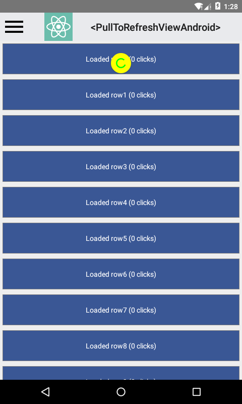

本组件是一个视图，可以放置单个可滚动子视图（比如ScrollView）。当子视图的竖直方向偏移（scrollY）为0时，将其下拉可以触发一个onRefresh事件。

### 截图


### 属性列表

<div class="props">
    <div class="prop"><h4 class="propTitle"><a class="anchor" name="view"></a><a href="view.html#props">View
        props...</a> <a class="hash-link" href="#view">#</a></h4></div>
    <div class="prop"><h4 class="propTitle"><a class="anchor" name="colors"></a>colors <span
            class="propType">[string]</span> <a class="hash-link" href="#colors">#</a></h4>
        <div><p>指定颜色（至少一种），用于绘制刷新的指示图标</p></div>
    </div>
    <div class="prop"><h4 class="propTitle"><a class="anchor" name="enabled"></a>enabled <span
            class="propType">bool</span> <a class="hash-link" href="#enabled">#</a></h4>
        <div><p>是否开启下拉刷新的功能</p></div>
    </div>
    <div class="prop"><h4 class="propTitle"><a class="anchor" name="progressbackgroundcolor"></a>progressBackgroundColor
        <span class="propType">string</span> <a class="hash-link" href="#progressbackgroundcolor">#</a></h4>
        <div><p>刷新指示图标的背景色</p></div>
    </div>
    <div class="prop"><h4 class="propTitle"><a class="anchor" name="refreshing"></a>refreshing <span class="propType">bool</span>
        <a class="hash-link" href="#refreshing">#</a></h4>
        <div><p>视图是否应该显示刷新指示图标</p></div>
    </div>
    <div class="prop"><h4 class="propTitle"><a class="anchor" name="size"></a>size <span class="propType">RefreshLayoutConsts.SIZE.DEFAULT</span>
        <a class="hash-link" href="#size">#</a></h4>
        <div><p>刷新指示图标的尺寸，请参阅PullToRefreshViewAndroid.SIZE</p></div>
    </div>
</div>

### 例子
```javascript
'use strict';

var React = require('react-native');
var {
  SliderIOS,
  Text,
  StyleSheet,
  View,
} = React;

var SliderExample = React.createClass({
  getInitialState() {
    return {
      value: 0,
    };
  },

  render() {
    return (
      <View>
        <Text style={styles.text} >
          {this.state.value}
        </Text>
        <SliderIOS
          {...this.props}
          onValueChange={(value) => this.setState({value: value})} />
      </View>
    );
  }
});

var styles = StyleSheet.create({
  slider: {
    height: 10,
    margin: 10,
  },
  text: {
    fontSize: 14,
    textAlign: 'center',
    fontWeight: '500',
    margin: 10,
  },
});

exports.title = '<SliderIOS>';
exports.displayName = 'SliderExample';
exports.description = 'Slider input for numeric values';
exports.examples = [
  {
    title: 'Default settings',
    render(): ReactElement {
      return <SliderExample />;
    }
  },
  {
    title: 'minimumValue: -1, maximumValue: 2',
    render(): ReactElement {
      return (
        <SliderExample
          minimumValue={-1}
          maximumValue={2}
        />
      );
    }
  },
  {
    title: 'step: 0.25',
    render(): ReactElement {
      return <SliderExample step={0.25} />;
    }
  }
];
```