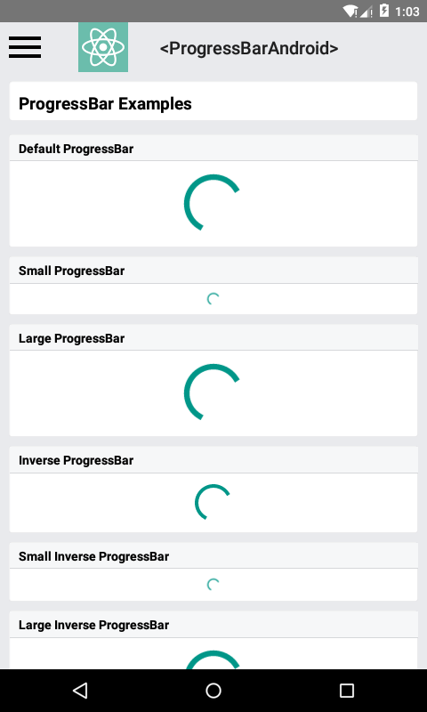

封装了Android平台上的`ProgressBar`的React组件。这个组件可以用来表示应用正在加载或者有些事情正在进行中。

例子：

```javascript
render: function() {
  var progressBar =
    <View style={styles.container}>
      <ProgressBar styleAttr="Inverse" />
    </View>;

  return (
    <MyLoadingComponent
      componentView={componentView}
      loadingView={progressBar}
      style={styles.loadingComponent}
    />
  );
},
```
### 截图


### 属性

<div class="props">
	<div class="prop">
		<h4 class="propTitle"><a class="anchor" name="view"></a><a href="view.html#props">View props...</a> <a class="hash-link" href="#view">#</a></h4>
	</div>
	<div class="prop">
		<h4 class="propTitle"><a class="anchor" name="color"></a>color <span class="propType">string</span> <a class="hash-link" href="#color">#</a></h4>
		<div>
			<p>进度条的颜色。</p>
		</div>
	</div>
	<div class="prop">
		<h4 class="propTitle"><a class="anchor" name="indeterminate"></a>indeterminate <span class="propType">indeterminateType</span> <a class="hash-link" href="#indeterminate">#</a></h4>
		<div>
			<p>决定进度条是否要显示一个不确定的进度。注意这个在styleAttr是Horizontal的时候必须是false。</p>
		</div>
	</div>
	<div class="prop">
		<h4 class="propTitle"><a class="anchor" name="progress"></a>progress <span class="propType">number</span> <a class="hash-link" href="#progress">#</a></h4>
		<div>
			<p>当前的进度值（在0到1之间）。</p>
		</div>
	</div>
	<div class="prop">
		<h4 class="propTitle"><a class="anchor" name="styleattr"></a>styleAttr <span class="propType">STYLE_ATTRIBUTES</span> <a class="hash-link" href="#styleattr">#</a></h4>
		<div>
			<p>进度条的样式。可取值有：</p>
			<ul>
				<li>Horizontal</li>
				<li>Small</li>
				<li>Large</li>
				<li>Inverse</li>
				<li>SmallInverse</li>
				<li>LargeInverse</li>
			</ul>
		</div>
	</div>
	<div class="prop">
		<h4 class="propTitle"><a class="anchor" name="testid"></a>testID <span class="propType">string</span> <a class="hash-link" href="#testid">#</a></h4>
		<div>
			<p>用来在端到端测试中定位这个视图。</p>
		</div>
	</div>
</div>

### 样例

```javascript
'use strict';

var ProgressBar = require('ProgressBarAndroid');
var React = require('React');
var UIExplorerBlock = require('UIExplorerBlock');
var UIExplorerPage = require('UIExplorerPage');

var TimerMixin = require('react-timer-mixin');

var MovingBar = React.createClass({
  mixins: [TimerMixin],

  getInitialState: function() {
    return {
      progress: 0
    };
  },

  componentDidMount: function() {
    this.setInterval(
      () => {
        var progress = (this.state.progress + 0.02) % 1;
        this.setState({progress: progress});
      }, 50
    );
  },

  render: function() {
    return <ProgressBar progress={this.state.progress} {...this.props} />;
  },
});

var ProgressBarAndroidExample = React.createClass({

  statics: {
    title: '<ProgressBarAndroid>',
    description: 'Visual indicator of progress of some operation. ' +
        'Shows either a cyclic animation or a horizontal bar.',
  },

  render: function() {
    return (
      <UIExplorerPage title="ProgressBar Examples">
        <UIExplorerBlock title="Default ProgressBar">
          <ProgressBar />
        </UIExplorerBlock>

        <UIExplorerBlock title="Small ProgressBar">
          <ProgressBar styleAttr="Small" />
        </UIExplorerBlock>

        <UIExplorerBlock title="Large ProgressBar">
          <ProgressBar styleAttr="Large" />
        </UIExplorerBlock>

        <UIExplorerBlock title="Inverse ProgressBar">
          <ProgressBar styleAttr="Inverse" />
        </UIExplorerBlock>

        <UIExplorerBlock title="Small Inverse ProgressBar">
          <ProgressBar styleAttr="SmallInverse" />
        </UIExplorerBlock>

        <UIExplorerBlock title="Large Inverse ProgressBar">
          <ProgressBar styleAttr="LargeInverse" />
        </UIExplorerBlock>

        <UIExplorerBlock title="Horizontal Indeterminate ProgressBar">
          <ProgressBar styleAttr="Horizontal" />
        </UIExplorerBlock>

        <UIExplorerBlock title="Horizontal ProgressBar">
          <MovingBar styleAttr="Horizontal" indeterminate={false} />
        </UIExplorerBlock>

        <UIExplorerBlock title="Large Red ProgressBar">
          <ProgressBar styleAttr="Large" color="red" />
        </UIExplorerBlock>

        <UIExplorerBlock title="Horizontal Black Indeterminate ProgressBar">
          <ProgressBar styleAttr="Horizontal" color="black" />
        </UIExplorerBlock>

        <UIExplorerBlock title="Horizontal Blue ProgressBar">
          <MovingBar styleAttr="Horizontal" indeterminate={false} color="blue" />
        </UIExplorerBlock>
      </UIExplorerPage>
    );
  },
});

module.exports = ProgressBarAndroidExample;
```