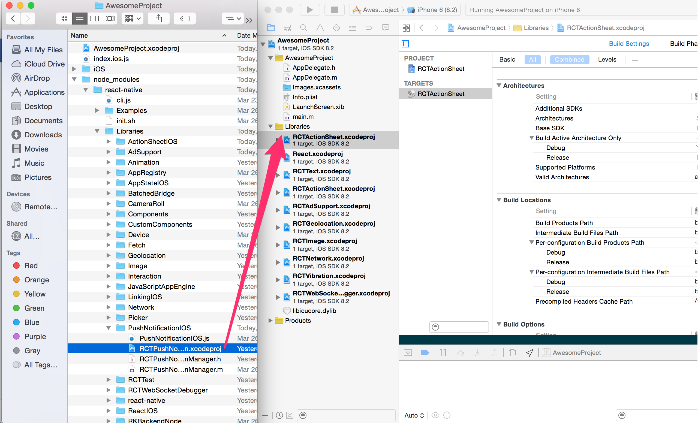
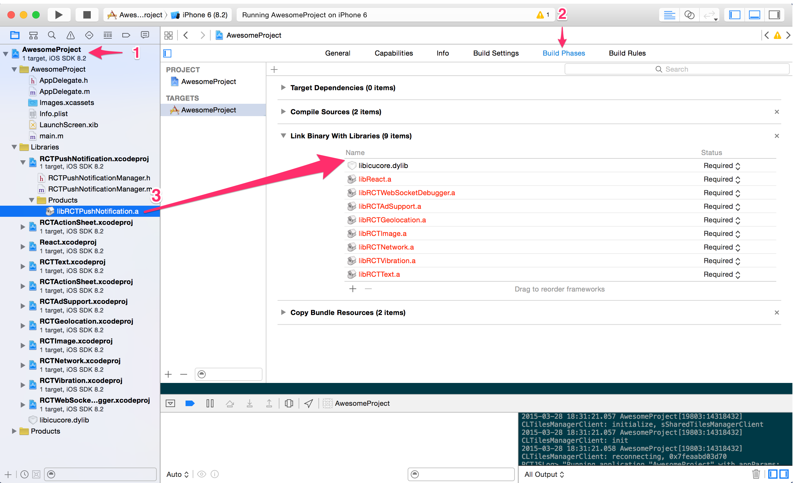

并不是所有的APP都需要使用全部的原生功能，包含支持全部特性的代码会增大应用的体积。但我们仍然希望能让你简单地根据自己的需求添加需要的特性。

在这种思想下，我们把许多特性都发布成为互不相关的静态库。

大部分的库只需要拖进两个文件就可以使用了，偶尔你还需要几步额外的工作，但不会再有更多的事情要做了。

_我们随着React Native发布的所有库都在仓库中的`Libraries`文件夹下。其中有一些是纯Javascript代码，你只需要去`require`它们就可以使用了。另外有一些库基于一些原生代码实现，你必须把这些文件添加到你的应用，否则应用会在你使用这些库的时候产生报错。_

## 添加包含原生代码的库需要几个步骤：

### 自动链接

#### 第一步
安装一个带原生依赖的库：  

```bash
$ npm install 某个带有原生依赖的库 --save
```

**注意:** 这一步中`--save`或`--save-dev`参数是非常重要的。React Native需要根据`package.json`文件中的`dependencies`和`devDependencies`记录来链接库。

#### 第二步

链接原生依赖：  

```bash
$ react-native link
```

完成了！现在所有的原生依赖都成功地链接到你的iOS/Android项目了。

### 手动链接

#### 第一步

如果该库包含原生代码，那么在它的文件夹下一定有一个`.xcodeproj`文件。
把这个文件拖到你的XCode工程下（通常拖到XCode的`Libraries`分组里）



#### 第二步

点击你的主工程文件，选择`Build Phases`，然后把刚才所添加进去的`.xcodeproj`下的`Products`文件夹中的静态库文件（.a文件），拖到`Link Binary With Libraries`组内。



#### 第三步

不是所有的库都需要进行这个步骤，你需要考虑的问题在于：

_我需要在编译的期间了解库的内容吗？_

这个问题的意思是，你是需要在原生代码中使用这个库，还是只需要通过JavaScript访问？如果你只需要通过JavaScript访问这个库，你就可以跳过这步了。

这一步骤对于我们随React Native发布的大部分库来说都不是必要的，但有两个例外是`PushNotificationIOS`和`LinkingIOS`。

以`PushNotificationIOS`为例，你需要在`AppDelegate`每收到一条推送通知之后，调用库中的一个方法。

这种情况下我们需要能够访问到库的头文件。为了能够顺利打包，你需要打开你的工程文件，选择`Build Settings`，然后搜索`Header Search Paths`，然后添加库所在的目录（如果它还有像`React`这样的子目录需要包含，注意要选中`recursive`选项）


